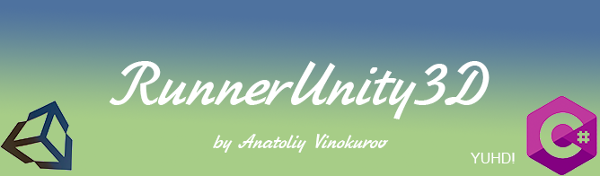
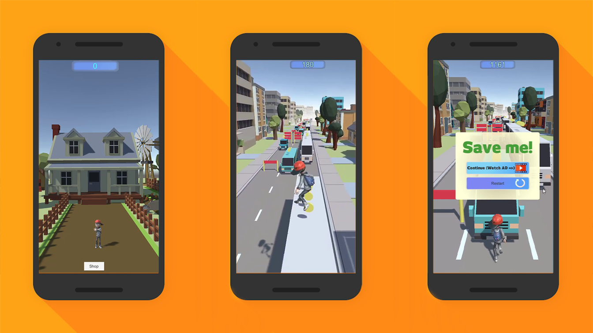
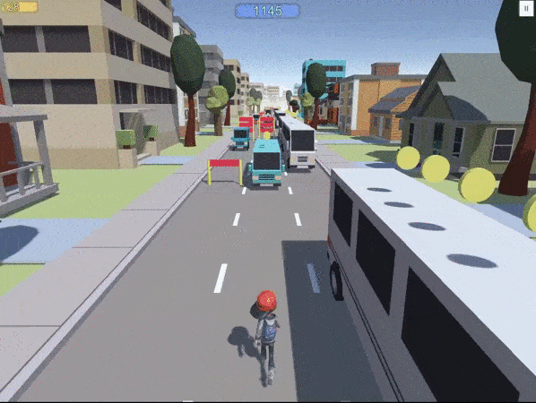
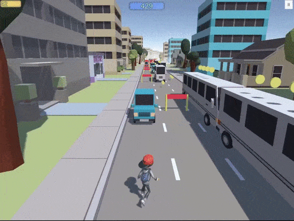

<h1 align="center"> YuhdRunnerUnity3D - Runner game for a smartphone created in Unity3D</h1>

## Description

Raner to smartphone is designed to run on devices running the Android, created on Unity3D.
The main essence of the game is running and collecting coins.

This is the first runnable version of the game

### Story

The story will be added later. In short description it is like this: a boy lives on a farm. One day a baby sheep runs away from him. He runs after the sheep. The sheep is small and it can pass under the car, but our character cannot - for this he needs to jump over the cars. Animation for switching from the menu, sheep, and other animations will be added soon.

### Main menu

The main menu contains an animated figurine of a player in the background of a house, a Play Button and a Skins Shop. When you press the "Play" button, the main menu is hidden and the camera is moved to the right and follows the character. Use the up buttons to jump, to the right and left - to turn, the down button - to rolling. The character needs to collect coins. The character can jump on a blue minibus and a blue car. The character must dodge the white buses, because he cannot jump on them (without the help of a springboard).

### Restart level

When hitting an obstacle, the "Save Me" screen appears. It contains two buttons - the "Continue" button and the "Restart" button. If you click on the "Restart" button, the level will start over and the user will lose the collected points. If you click on the "Continue" button, the advertisement will be launched (the advertisement will be implemented later). After watching the advertisement, the user will be able to continue the game further without losing points.

### Selection of skins

The user can buy skins for the collected coins and activate them in the main menu by clicking on the "Shop" button.

### Side collision

If the character turns to the side and there is an obstacle, then the stutter animation will work and the game will continue without loss.

### Jump badly

Since the car is in the shape of a square, it was decided to add event handling. Now, if a player tried to jump over the car and failed and hit the hood, this is not protected for a loss. The game will push the character up as if on an invisible springboard.

## Project setup

Import this project to Unity3D version not lower than Unity3D 5.6.4

## Known bugs

- Not all buttons in the main menu are implemented. Now only the store button and the play button work.
- Save me menu won't close
- camera flips when exiting "save me"
- when the character tries to rolling on the roof of the bus, the game ends

## Future scope

- need to make a game

## Thanks

I express my deep gratitude to the authors, from whose teaching materials I learned while making this game.
youtube channels: def1NeX, Unity City, Graphical Design, Гоша Дударь, devon.o